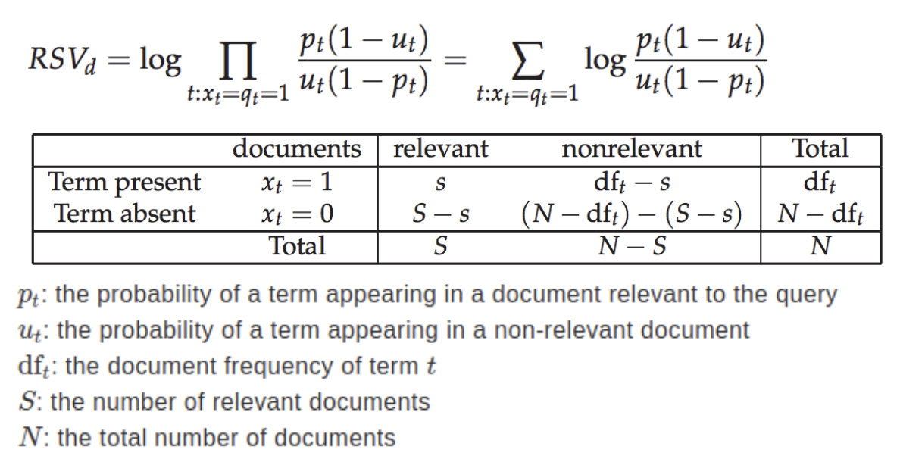

## WSM Assignment 2: Probabilistic Information Retrieval and Language Model for Information Retrieval
1. [20 points] **Probabilistic Information Retrieval**
    Consider the RSJ retrieval model, the contingency table of counts of documents, and the statements below:
    

   - [5/20 points] What are the differences between standard VSM with tf-idf weightings and the RSJ probabilistic retrieval model (in the case where no relevance information is provided)?
    > **Ans：** 
    > Weighting：VSM with tf-idf using tf-idf weight for each term in document or query represent while RSJ model calculating probabilistic weights aim to maximize probability of retrieving relevant documents.
    > Assumption：VSM with tf-idf assume that the rare terms are more useful for identifying a document's unique content, while RSJ assume that the independence of terms, that is every term appear independently of each other within documents, simplifying probability calculations.
   - [5/20 points] Describe the differences of relevance feedback used in VSM and probabilistic retrieval models.
    > **Ans：** 
    > VSM with Relevance Feedback: The modified query is created by adding and subtracting average vector of relevant and non-relevant documents from original query vector. Also shifting the query towards relevant documents in the vector space, helping to retrieve similar documents in next iteration.
    > RSJ Model with Relevance Feedback: feedback updates probability estimates for improved ranking of relevant documents.

   - [10/20 points] Please show that based on the model above, documents can be ranked via the following formula:
    
    (Hint: Try to prove that such a formula is equivalent to the RSJ model that states above.)
    > **Ans：** 
    > $RSV_d$ = $log(\prod \limits_{t:x_t=q_t=1}^{}\dfrac{p_t(1-u_t)}{u_t(1-p_t)})$
    > => $p_t = \dfrac{s}{S}$：Probability of term $t$ appearing in relevant documents.
    > => $u_t = \dfrac{d_t-s}{N-S}$：Probability of term $t$ appearing in non-relevant documents.
    > => Substitute $p_t$ and $u_t$ into the RSJ model：
    > => $RSV_d = \sum \limits_{t:x_t=q_t=1}^{} \log(\dfrac{\frac{s}{S}*(1-\frac{d_t-s}{N-S})}{\frac{d_t-s}{N-S}*(1-\frac{s}{S})})$
    > => Simplified: devide S*(N-S) 
2. [20 points] **Language Model**
    Consider making a language model from the following training text:
        **she grows flowers in the garden**
        **the flowers she grows are surely flowers**
        **so if she grows flowers in the garden**
        **I am sure she grows garden flowers**

    - [10/20 points] Under a MLE-estimated unigram probability model, what are P(the) and P(garden)?
    > **Ans：** 
    > total words: 28
    > unigram count: (the: 3), (garden: 2)
    > - $P(\text{the}) = \frac{\text{count(the)}}{\text{total words}} = \frac{3}{28} \approx 0.107
$
    > - $P(\text{garden}) = \frac{\text{count(garden)}}{\text{total words}} = \frac{2}{28} \approx 0.071$
    - [10/20 points] Under a MLE-estimated bigram model, what are P(flowers | grows) and P(grows | she)?
    > **Ans：** 
    > unigram count: (grows: 4), (she: 4)
    > bigram count: (grows, flowers: 3), ((she, grows: 4)
    > - $P(\text{flowers} \mid \text{grows}) = \frac{\text{count}(\text{grows, flowers})}{\text{count}(\text{grows})} = \frac{2}{4} = 0.5
$
    > - $P(\text{grows} \mid \text{she}) = \frac{\text{count}(\text{she, grows})}{\text{count}(\text{she})} = \frac{4}{4} = 1.0$
3. [15 points] **Language Model**
    Suppose we have a collection that consists of the 4 documents given in the below table.
    
    Build a query likelihood language model for this document collection. Assume a mixture model between the documents and the collection, with both weighted at 0.5. Maximum Likelihood Estimation (MLE) is used to estimate both as unigram models. Work out the model probabilities of the queries click, shears, and hence click shears for each document, and use those probabilities to rank the documents returned by following query.
    > Term Frequency：
    
     | Term   | Doc1 | Doc2 | Doc3 | Doc4 | CTotal |
     | ------ | :--: | :--: | :--: | :--: | :----: |
     | click  |  4   |  2   |  0   |  1   |   7    |
     | go     |  1   |  0   |  0   |  0   |   1    |
     | the    |  1   |  0   |  0   |  0   |   1    |
     | shears |  1   |  0   |  0   |  1   |   2    |
     | boys   |  1   |  0   |  0   |  0   |   1    |
     | metal  |  0   |  0   |  1   |  1   |   2    |
     | here   |  0   |  0   |  1   |  1   |   2    |
     | Total  |  8   |  2   |  2   |  4   |   16   |

    > Maximum Likelyhood Estimation (MLE)：( Prob of each term in specific doc )
    > $P_{MLE} (t \mid d) = \dfrac{ \text{count(t,d)} } {\text{length of d}} $
    > Collection MLE ( Probability of each term in the collection )
    > $P_{MLE} (t \mid C) = \dfrac{ \text{count(t,C)} } {\text{total collection length}} $
    
    | Term   |     $P(t\mid d1)$     |   $P(t\mid d2)$   |    $P(t\mid d3)$    |    $P(t\mid d4)$     |      $P(t\mid C)$      |
    | ------ | :-------------------: | :---------------: | :-----------------: | :------------------: | :--------------------: |
    | click  |  $\frac{4}{8} = 0.5$  | $\frac{2}{2} = 1$ |          0          | $\frac{1}{4} = 0.25$ | $\frac{7}{16} ≈ 0.563$ |
    | go     | $\frac{1}{8} = 0.125$ |         0         |          0          |          0           | $\frac{1}{16} ≈ 0.063$ |
    | the    | $\frac{1}{8} = 0.125$ |         0         |          0          |          0           | $\frac{1}{16} ≈ 0.063$ |
    | shears | $\frac{1}{8} = 0.125$ |         0         |          0          | $\frac{1}{4} = 0.25$ | $\frac{2}{16} ≈ 0.125$ |
    | boys   | $\frac{1}{8} = 0.125$ |         0         |          0          |          0           | $\frac{1}{16} ≈ 0.063$ |
    | metal  |           0           |         0         | $\frac{1}{2} = 0.5$ | $\frac{1}{4} = 0.25$ | $\frac{2}{16} ≈ 0.125$ |
    | here   |           0           |         0         | $\frac{1}{2} = 0.5$ | $\frac{1}{4} = 0.25$ | $\frac{2}{16} ≈ 0.125$ |
    
    > Query Likelihood Calculation Using Mixture Model
    > $P(t\mid d) = 0.5 × P_{MLE}(t \mid d) + 0.5 × P_{MLE}(t \mid C)$

   - [5/15 points] click
    
    | Doc ID |     $𝑃(click\mid 𝑑)$     |
    | ------ | :------------------------: |
    | doc2   | 0.5×1.0 + 0.5×0.47 = 0.735 |
    | doc1   | 0.5×0.5 + 0.5×0.47 = 0.485 |
    | doc3   |  0.5×0 + 0.5×0.47 = 0.235  |
    | doc4   | 0.5×0.33 + 0.5×0.47 = 0.4  |
    > **Ans:** doc2 > doc1 > doc3 > doc4 

   - [5/15 points] shears
    
    | Doc ID |      $𝑃(shear\mid 𝑑)$       |
    | ------ | :---------------------------: |
    | doc1   | 0.5×0.125 + 0.5×0.133 = 0.129 |
    | doc2   |   0.5×0 + 0.5×0.133 = 0.067   |
    | doc3   |   0.5×0 + 0.5×0.133 = 0.067   |
    | doc4   | 0.5×0.33 + 0.5×0.133 = 0.232  |
    > **Ans:** doc1 > doc2 > doc3 > doc4

   - [5/15 points] click shears
    > $𝑃(click~shears \mid 𝑑) = 𝑃(click \mid 𝑑) * 𝑃(shear \mid 𝑑)$

    | Doc ID | $𝑃(click shears\mid 𝑑)$ |
    | ------ | :-----------------------: |
    | doc4   |    0.4 × 0.232=0.0928     |
    | doc1   |   0.485 × 0.129=0.0625    |
    | doc2   |   0.735 × 0.067=0.0492    |
    | doc3   |  0.235 x 0.067 = 0.0157   |
    > **Ans:** doc4 > doc1 > doc2 > doc3

4. [10 points] **Mixture model**
    Given the query "Hualien Taoyuan", please compute the ranking of the three documents by MLE unigram models from the documents and collection, mixed with lambda = 1/2

    - He moved from Hualien, Taipei, to Hualien, Taoyuan.
    - He moved from Hualien, Taoyuan, to Hualien, Taipei.
    - He moved from Taoyuan to Hualien, Taipei.

    > Term Frequencies

    |  Term   |   $𝑃(t\mid 𝑑1)$   |   $𝑃(t\mid d2)$    |   $𝑃(t\mid 𝑑3)$   |  $𝑃(t\mid Collect$  |
    | :-----: | :-----------------: | :-----------------: | :-----------------: | :------------------: |
    | Hualien | $\frac{2}{8}=0.25$  | $\frac{2}{8}=0.25$  | $\frac{1}{7}=0.143$ | $\frac{5}{23}=0.217$ |
    | Taoyuan | $\frac{1}{8}=0.125$ | $\frac{1}{8}=0.125$ | $\frac{1}{7}=0.143$ | $\frac{3}{23}=0.130$ |
    
    > Mixture Model Probabilities (with 𝜆 = 0.5)

    |  Term   |        $𝑃(t\mid 𝑑1)$        |        $𝑃(t\mid d2)$         |       $𝑃(t\mid 𝑑3)$        |
    | :-----: | :---------------------------: | :---------------------------: | :--------------------------: |
    | Hualien | 0.5×0.25 + 0.5×0.217 = 0.2335 | 0.5×0.25 + 0.5×0.217 = 0.2335 | 0.5×0.143 + 0.5×0.217 = 0.18 |
    | Taoyuan | 0.5×0.125 + 0.5×0.13 = 0.1275 | 0.5×0.125 + 0.5×0.13 = 0.1275 |  0.5×0.143+0.5×0.13=0.1365   |

    > Query Likelihood for "Hualien Taoyuan" in Each Document
    > $𝑃(Hualien~Taoyuan \mid 𝑑) = 𝑃(Hualien \mid 𝑑) * 𝑃(Taoyuan \mid 𝑑)$
    > $doc 1 = 0.2335×0.1275 = 0.0298$
    > $doc 2 = 0.2335×0.1275 = 0.0298$
    > $doc 3 = 0.18×0.1365 = 0.02457$

    > **ANS:** 
    > Ranking：
    > 1 Document 1: 0.0298
    > 2 Document 2: 0.0298
    > 3 Document 3: 0.02457

5. [35 points] **Classic Probabilistic Retrieval Model.**
    [15/35 points] In the derivation of the Robertson-Sparck-Jones (RSJ) model (see the slides and the survey paper by Norbert Fuhr for detail about this derivation), a multi-variate Bernoulli model was used to model term presence/absence in a relevant document and a non-relevant document. Suppose, we change the model to a multinomial model (see the slide that covers both models for computing query likelihood). Using a similar independence assumption as we used in deriving RSJ, show that ranking based on probability that a document is relevant to a query Q, i.e., p(R=1 | D,Q), is equivalent to ranking based on the following formula:
    

    where the sum is taken over all the word in our vocabulary (denoted by V). How many parameters are there in such a retrieval model?
    
    > 1. Assume each word $w$ in our vocabulary $V$ appears independently.
    > 2. Compute $P(R=1\mid D, Q)$ Using Bayes' theorem
    > => $P(R=1\mid Q) = \dfrac{P(D\mid Q,R=1)\cdot P(R=1\mid Q)}{P(D\mid Q)}$
    > 3. Assume $P(R=1\mid D, Q)$ is constant
    > => $\therefore P(R=1|D, Q) \propto P(D\mid Q, R=1)$
    > 4. Assume that document $D$ is generated by drawing words from a multinomial distribution conditioned on relevance $R$
    > => $\therefore P(D\mid Q, R=1) = \prod\limits_{w\in V}^{} P(w\mid Q, R=1)^{f _{w,D}}$
    > => where $(f _{w,D})$ is the frequency of word $w$ in document $D$
    > 5. Log-Likeligood and simplified ranking formula:
    > => $\log P(D\mid Q, R=1) = \sum \limits_{w\in V}^{}f_{w, D}~\log P(w\mid Q, R=1)$
    > => $\log P(D\mid Q, R=0) = \sum \limits_{w\in V}^{}f_{w, D}~\log P(w\mid Q, R=0)$
    > => $\sum\limits_{w\in V}{}f_{w, D}*(\log P(w\mid Q, R=1)) - \log P(w\mid Q, R=0)$
    > => $\sum\limits_{w\in V}^{} f_{w, D}\log\dfrac{P(w\mid Q, R=1)}{P(w\mid Q, R=0) }$
    > => (Q.E.D)

    - [5/35 points] The retrieval function above won't work unless we can estimate all the parameters. Suppose we use the entire collection C={D1,...,Dn} as an approximation of the examples of non-relevant documents. Propose an estimate of p(w|Q,R=0). (Hint: study the slide about how to do this for the RSJ model.)
    
    > Ans: $P(w\mid Q, R=0) = \dfrac{\text{count(w, C)}}{\sum\limits_{w\in V}^{} \text{count(w', C)}}$
    
    - [5/35 points] Suppose we use the query as the only example of a relevant document. Propose an estimate of p(w|Q,R=1).
    
    > Ans: $P(w\mid Q, R=1) = \dfrac{\text{count(w, C)}}{\sum\limits_{w\in V}^{} \text{count(w', C)}}$

    - [5/35 points] With the two estimates you proposed, we should now have a retrieval function that can be used to compute a score for any document D and any query Q. Write down your retrieval function by plugging in the two estimates. Can your retrieval function capture the three major retrieval heuristics (i.e., TF, IDF, and document length normalization)? How?
    
    > $\text{Score}(D, Q) = \sum\limits_{w \in V}^{} f_{w,D} \cdot \log \dfrac{\frac{\text{count}(w, Q)}{\sum_{w' \in Q} \text{count}(w', Q)}}{\frac{\text{count}(w, C)}{\sum_{w' \in V} \text{count}(w', C)}}$

    - [5/35 points] Do you believe your formula would work well as compared with a state of the art formula such as BM25? Can you propose a way to further improve your formula? (While it's the best if you could improve your formula through using an improved estimate of p(w|Q,R=1), it would also be fine to propose any reasonable heuristic modification of the formula.)
    > To improve:
    > 1. Length Normalization: Apply a BM25-style normalization, adjusting $f_w, D$ with document length
    > 2. Smoothing: Use some smoothing methods to handle rare terms and zero frequencies in P(q\mid Q, R=1) or P(w\mid Q, R=0)