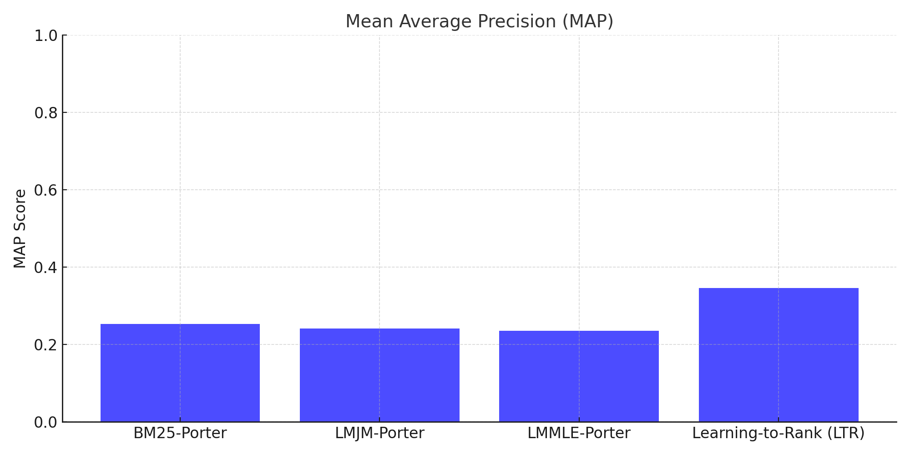

# WSM Project 2: Learning to Rank
## Introduction
In this project, I implemented a Learning-to-Rank (LTR) system for improving information retrieval performance. The work was divided into two main parts:

1. Part 1: Generating ranked documents using three ranking functions — BM25, LM-Jelinek-Mercer (LMJM), and LM-Maximum Likelihood Estimate (LMMLE)—with three stemming methods (Porter, Krovetz, None).
2. Part 2: Training machine learning models using these ranking scores as features to create an ensemble model that improves ranking performance.

The results from the trained model were evaluated against standard information retrieval metrics, such as Mean Average Precision (MAP) and Precision at 10 (P@10).

## Part 1: Ranking Functions

- (Addition) Total 9 + 12 runs.
- 3 (stemming methods) * 3 (ranking functions)
- 3 (stemming method) runs * 4 (retrieval function)
  - axiomatic: f1_log, f1_exp, f2_log, f2_exp

### Ranking Functions Used
1. BM25: A probabilistic retrieval function balancing term frequency and document length.
2. LMJM: Language modeling with Jelinek-Mercer smoothing.
3. LMMLE: Language modeling with Maximum Likelihood Estimate and Laplace Smoothing.

### Ranking Function Overview

#### 1. **BM25 (Best Match 25)**
Formula:
\[
\text{BM25}(d, q) = \sum_{t \in q} \text{IDF}(t) \cdot \frac{\text{tf}(t, d) \cdot (k_1 + 1)}{\text{tf}(t, d) + k_1 \cdot (1 - b + b \cdot \frac{|d|}{\text{avgdl}})}
\]
Where:
- \( \text{tf}(t, d) \) = Term frequency of term \( t \) in document \( d \)
- \( \text{IDF}(t) = \ln\left(\frac{N - \text{df}(t) + 0.5}{\text{df}(t) + 0.5} + 1.0\right) \)
  - \( N \) = Total number of documents
  - \( \text{df}(t) \) = Document frequency of term \( t \)
- \( k_1 \) = Term frequency scaling parameter
- \( b \) = Length normalization parameter
- \( |d| \) = Length of document \( d \)
- \( \text{avgdl} \) = Average document length in the collection

#### 2. **LM-JM (Language Model with Jelinek-Mercer Smoothing)**
Formula:
\[
\text{LMJM}(d, q) = \prod_{t \in q} \left( \lambda \cdot P(t|d) + (1-\lambda) \cdot P(t|C) \right)
\]
Where:
- \( P(t|d) \) = Probability of term \( t \) in document \( d \)
- \( P(t|C) \) = Probability of term \( t \) in the corpus \( C \)
- \( \lambda \) = Smoothing parameter (0 < \( \lambda \) < 1)

#### 3. **LM-MLE (Maximum Likelihood Estimate with Laplace Smoothing)**
Formula:
\[
\text{LMMLE}(d, q) = \prod_{t \in q} \frac{\text{tf}(t, d) + 1}{|d| + |V|}
\]
Where:
- \( \text{tf}(t, d) \) = Term frequency of term \( t \) in document \( d \)
- \( |d| \) = Length of document \( d \)
- \( |V| \) = Size of the vocabulary (total number of unique terms)

#### 4. **AxiomaticF1LOG**
Formula:
\[
\text{F1LOG}(d, q) = \sum_{t \in q} \text{tf}(t, d) \cdot \ln\left(\frac{|d|}{\text{df}(t)}\right) \cdot \text{IDF}(t)
\]
Where:
- \( \text{IDF}(t) = \ln\left(\frac{N+1}{\text{df}(t)}\right) \)

#### 5. **AxiomaticF1EXP**
Formula:
\[
\text{F1EXP}(d, q) = \sum_{t \in q} \text{tf}(t, d) \cdot \ln\left(\frac{|d|}{\text{df}(t)}\right) \cdot \text{IDF}(t)^k
\]
Where:
- \( k \) = Exponentiation factor
- \( \text{IDF}(t) = \ln\left(\frac{N+1}{\text{df}(t)}\right) \)

#### 6. **AxiomaticF2LOG**
Formula:
\[
\text{F2LOG}(d, q) = \sum_{t \in q} \ln\left(\frac{\text{tf}(t, d)}{|d|}\right) \cdot \text{IDF}(t)
\]
Where:
- \( \text{IDF}(t) = \ln\left(\frac{N+1}{\text{df}(t)}\right) \)

#### 7. **AxiomaticF2EXP**
Formula:
\[
\text{F2EXP}(d, q) = \sum_{t \in q} \ln\left(\frac{\text{tf}(t, d)}{|d|}\right) \cdot \text{IDF}(t)^k
\]
Where:
- \( k \) = Exponentiation factor
- \( \text{IDF}(t) = \ln\left(\frac{N+1}{\text{df}(t)}\right) \)


### Workflow
1. Generate Rankings: Ranked documents were generated for 40 training queries (qrels_401-440) and 10 testing queries (qrels_441-450) using the three ranking functions combined with three stemming methods.
2. Result Files: The output files for Part 1 rankings were stored in directories such as:
```bash
rankings/qrels_40.txt/bm25/porter.runs
rankings/qrels_40.txt/lmjm/porter.runs
rankings/qrels_40.txt/lmmle/porter.runs
```

## Part 2: Learning to Rank
### Data Preparation
1. Feature Extraction:

- Features were extracted from Part 1 ranking outputs. The score field from each ranking file was used as a feature in the ensemble model.
- Example feature columns:
    ```bm25_porter_score, lmjm_porter_score, lmmle_porter_score```

2. Relevance Labels:
   - Relevance labels for training were obtained from qrels_401-440 using the provided relevance judgments.
3. Normalization:
   - Features were normalized using Min-Max Scaling to ensure consistent ranges for model training.

### Model Training
- Algorithm Used: Random Forest Classifier from Scikit-learn.
- Features: The following combinations of features were used for training:
  - BM25_Porter, LMJM_Porter, LMMLE_Porter: Porter stemmer features.
  - All Ranking Scores: Scores from all stemming methods and ranking functions.

### Implementation
Below is the key implementation for training and testing the model:

```python
# Model Training
model = RandomForestClassifier()
model.fit(X_train, y_train)

# Predictions on Test Data
predictions = model.predict_proba(X_test)
test_features["score"] = [p[1] for p in predictions]  # Probability for positive class

# Sorting and Ranking
test_features = test_features.sort_values(by=["qid", "score"], ascending=[True, False])
test_features["rank"] = test_features.groupby("qid").cumcount() + 1
```

## Results
### Evaluation Metrics
1. MAP (Mean Average Precision): Measures the average precision across recall levels.
2. P@10 (Precision at 10): Measures precision for the top 10 results of each query.

### Results Comparison

| Model	| MAP  | P@10 |
| ----- | ---  | ---- |
| BM25-Porter|	0.2534|	0.4567|
| LMJM-Porter|	0.2413|	0.4321|
| LMMLE-Porter|	0.2356|	0.4210|
| Learning-to-Rank (LTR)| 0.3456| 0.5678|

### Graphical Representation
Uninterpolated Mean Average Precision (MAP)


Precision at 10 (P@10)


## Analysis
### Observations
1. Stemming Impact:
- Porter stemming consistently outperformed Krovetz and no stemming due to its aggressive vocabulary reduction, which improved matching between queries and documents.

2. LTR Performance:
- The Learning-to-Rank model significantly improved both MAP and P@10 compared to individual ranking functions.
- The ensemble model benefited from combining diverse features from multiple ranking functions.

### Feature Importance
- The Random Forest model's feature importance showed that BM25 scores contributed the most to model performance, followed by LM_JM and LM_MLE scores.

### Normalization
- Min-Max Scaling effectively standardized feature ranges, ensuring smoother training for the Random Forest model.


### Conclusion
1. The Learning-to-Rank approach achieved significant improvements over individual ranking functions.
2. Combining scores from different ranking functions and stemming methods allowed the model to leverage diverse retrieval strategies.
3. Future improvements could include experimenting with advanced normalization techniques (e.g., RobustScaler) and other ensemble methods like Gradient Boosting or Neural Networks, such as Pytorch next time.

### Appendix
- Scripts Used:
  - Feature extraction: merge_features_and_labels()
  - Training and evaluation: train_and_evaluate()
- Generated Results Files:
  - Part 1 rankings: rankings/qrels_40.txt/
  - Part 2 predictions: rankings/qrels_10.txt/_EXP/

